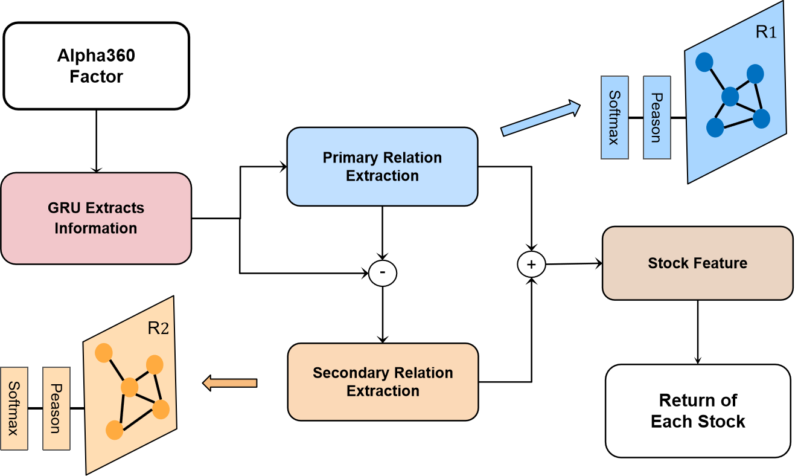

# The GRU-PFG framework for stock prediction
The implementation of the paper "[GRU-PFG: Extract Inter-Stock Correlation from Stock Factors with Graph Neural Network](https://arxiv.org/abs/2411.18997)".Considering the current state and limitations of these two types of models, this paper proposes the GRU-PFG (Project Factors into Graph) model. This model only takes stock factors as input and extracts inter-stock correlations using graph neural networks.




## Environment
1. Install python3.7, 3.8 or 3.9. 
2. Install the requirements in [requirements.txt](https://github.com/Wentao-Xu/HIST/blob/main/requirements.txt).
3. Install the quantitative investment platform [Qlib](https://github.com/microsoft/qlib) and download the data from Qlib:
	```
	# install Qlib from source
	pip install --upgrade  cython
	git clone https://github.com/microsoft/qlib.git && cd qlib
	python setup.py install

	# Download the stock features of Alpha360 from Qlib
	python scripts/get_data.py qlib_data --target_dir ~/.qlib/qlib_data/cn_data --region cn --version v2
	```
### Reproduce our framework
```
# CSI 100
python learn.py --model_name GRUPFG --data_set csi100 --hidden_size 128 --num_layers 2 --outdir ./output/csi100_GRU_PFG

# CSI 300
python learn.py --model_name GRUPFG --data_set csi300 --hidden_size 128 --num_layers 2 --outdir ./output/csi300_GRU_PFG
```
### Reproduce HIST framework
```
# CSI 100
python learn.py --model_name HIST --data_set csi100 --hidden_size 128 --num_layers 2 --outdir ./output/csi100_HIST

# CSI 300
python learn.py --model_name HIST --data_set csi300 --hidden_size 128 --num_layers 2 --outdir ./output/csi300_HIST
```
### Reproduce the baselines
* MLP 
```
# MLP on CSI 100
python learn.py --model_name MLP --data_set csi100 --hidden_size 512 --num_layers 3 --outdir ./output/csi100_MLP

# MLP on CSI 300
python learn.py --model_name MLP --data_set csi300 --hidden_size 512 --num_layers 3 --outdir ./output/csi300_MLP
```

* LSTM
```
# LSTM on CSI 100
python learn.py --model_name LSTM --data_set csi100 --hidden_size 128 --num_layers 2 --outdir ./output/csi100_LSTM

# LSTM on CSI 300
python learn.py --model_name LSTM --data_set csi300 --hidden_size 128 --num_layers 2 --outdir ./output/csi300_LSTM
```

* GRU
```
# GRU on CSI 100
python learn.py --model_name GRU --data_set csi100 --hidden_size 128 --num_layers 2 --outdir ./output/csi100_GRU

# GRU on CSI 300
python learn.py --model_name GRU --data_set csi300 --hidden_size 64 --num_layers 2 --outdir ./output/csi300_GRU
```

* SFM
```
# SFM on CSI 100
python learn.py --model_name SFM --data_set csi100 --hidden_size 64 --num_layers 2 --outdir ./output/csi100_SFM

# SFM on CSI 300
python learn.py --model_name SFM --data_set csi300 --hidden_size 128 --num_layers 2 --outdir ./output/csi300_SFM
```

* GATs
```
# GATs on CSI 100
python learn.py --model_name GATs --data_set csi100 --hidden_size 128 --num_layers 2 --outdir ./output/csi100_GATs

# GATs on CSI 300
python learn.py --model_name GATs --data_set csi300 --hidden_size 64 --num_layers 2 --outdir ./output/csi300_GATs
```

* ALSTM
```
# ALSTM on CSI 100
python learn.py --model_name ALSTM --data_set csi100 --hidden_size 64 --num_layers 2 --outdir ./output/csi100_ALSTM

# ALSTM on CSI 300
python learn.py --model_name ALSTM --data_set csi300 --hidden_size 128 --num_layers 2 --outdir ./output/csi300_ALSTM
```

* Transformer
```
# Transformer on CSI 100
python learn.py --model_name Transformer --data_set csi100 --hidden_size 32 --num_layers 3 --outdir ./output/csi100_Transformer

# Transformer on CSI 300
python learn.py --model_name Transformer --data_set csi300 --hidden_size 32 --num_layers 3 --outdir ./output/csi300_Transformer
```

## Citation
```
@misc{zhuang2024grupfgextractinterstockcorrelation,
      title={GRU-PFG: Extract Inter-Stock Correlation from Stock Factors with Graph Neural Network}, 
      author={Yonggai Zhuang and Haoran Chen and Kequan Wang and Teng Fei},
      year={2024},
      eprint={2411.18997},
      archivePrefix={arXiv},
      primaryClass={q-fin.CP},
      url={https://arxiv.org/abs/2411.18997}, 
}
```
